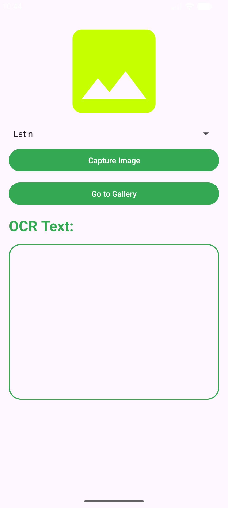
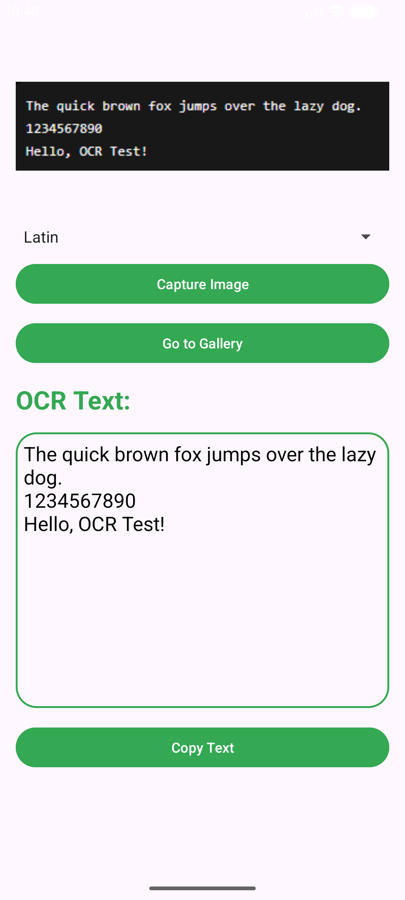
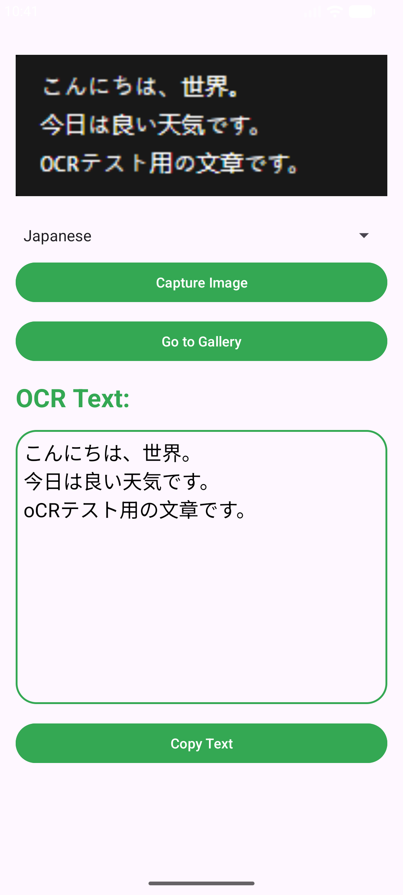
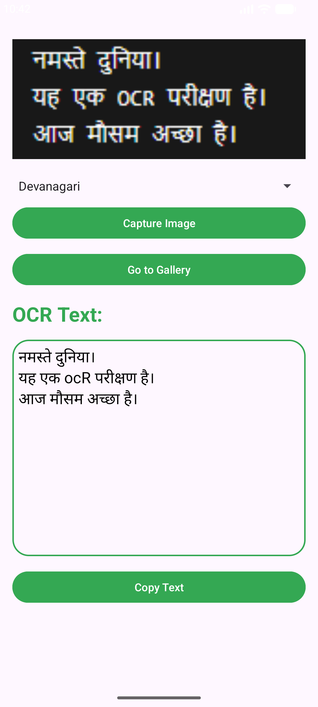

# TextOCRApp

A native Android application that extracts text from images using Google ML Kit's on-device OCR engine. Users can capture a photo or pick one from the gallery, select the script language, and instantly see the recognized text — all processed locally without any network requests.

---

## Screenshots

| App Preview | Latin OCR | Japanese OCR | Devanagari OCR |
|:-----------:|:---------:|:------------:|:--------------:|
|  |  |  |  |

---

## Features

- **Camera capture** — take a photo directly from within the app
- **Gallery picker** — select any image from the device gallery
- **Multi-script OCR** — supports Latin, Chinese, Japanese, Korean, and Devanagari scripts
- **Dynamic language switching** — change the script on an already-loaded image and re-run recognition instantly
- **Copy to clipboard** — one-tap copy of the recognized text
- **Fully on-device** — no internet connection required; all processing happens locally via ML Kit

---

## Tech Stack

| Layer | Technology |
|---|---|
| Language | Kotlin |
| Min SDK | API 24 (Android 7.0) |
| Target SDK | API 36 |
| OCR Engine | Google ML Kit Text Recognition |
| Image Source | CameraX (via `TakePicture` contract) + `GetContent` |
| File Sharing | `FileProvider` |
| UI | XML Layouts, Material3 |

---

## Supported Scripts

| Script | ML Kit Library |
|---|---|
| Latin | `text-recognition:16.0.1` |
| Chinese | `text-recognition-chinese:16.0.1` |
| Japanese | `text-recognition-japanese:16.0.1` |
| Korean | `text-recognition-korean:16.0.1` |
| Devanagari | `text-recognition-devanagari:16.0.1` |

---

## Getting Started

1. Clone the repository:
   ```bash
   git clone https://github.com/your-username/TextOCRApp.git
   ```
2. Open in Android Studio.
3. Build and run on a device or emulator with API 24+.

No additional configuration or API keys are required.

---

## Permissions

- `CAMERA` — required to capture images directly within the app

---

## Project Structure

```
app/src/main/
├── java/com/samedtevin/textocrapp/
│   └── MainActivity.kt        # Core logic: camera, gallery, OCR, clipboard
├── res/
│   ├── layout/activity_main.xml
│   ├── values/strings.xml     # Language list
│   ├── drawable/border.xml    # Rounded text box border
│   └── xml/provider_paths.xml # FileProvider config
└── AndroidManifest.xml
```


